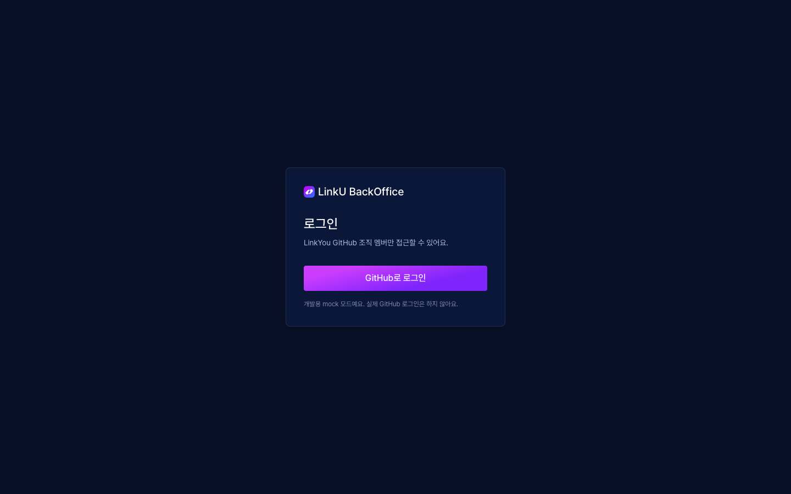

# LinkYou-BackOffice

LinkYou 프로젝트의 인프라 관리 & 서비스 운영을 위한 BackOffice 레포지토리입니다.

- **서버 제어**: dev 서버(EC2)를 켜고 끄고, 앱 헬스·모니터링 상태를 확인합니다. 끌 때는 모니터링 알람을 먼저 무음 처리합니다.
- **서비스 운영** *(준비 중)*: LinkU `/api/v1/admin/**` 연동 화면 (유저 / 큐레이션 / 블로그)

> 이 앱은 dev 서버와 **별도로 호스팅**해야 합니다. dev 가 꺼져 있어도 켤 수 있어야 하기 때문입니다.

## 스택

Vite · React 19 · TypeScript · Tailwind CSS v4 · React Router · TanStack Query · Vitest

## 시작하기

```bash
npm install
npm run dev        # http://localhost:5173  (mock 모드)
```

| 명령 | 설명 |
|---|---|
| `npm run dev` | 개발 서버. `.env.development` 때문에 **mock 모드**로 뜹니다. |
| `npm run build` | 타입 체크 + 프로덕션 빌드 (`dist/`) |
| `npm run typecheck` | 타입 체크만 |
| `npm test` | 단위 테스트 |

mock 모드에서는 백엔드 없이 로그인·상태 전환(켜기/끄기)·이력을 브라우저 안에서 흉내 냅니다. 사이드바에 `MOCK 모드` 배지가 보입니다.

## 화면

`npm run dev`(mock 모드) 기준 캡처입니다. 데스크톱(1440px) 기준 화면입니다.

### 로그인


### 서버 제어 — 켜져 있을 때


### 서버 끄기 확인


### 서버 끄는 중 — 모니터링 끄기 → EC2 중지 → 완료


### 서버 제어 — 꺼져 있을 때


### 서버 켜는 중 — EC2 시작 → 앱 헬스 확인 → 모니터링 켜기 → 완료


### 서비스 운영 (준비 중)


## 환경 변수

`.env.example` 참고. 실제 API 로 붙일 때는 `.env.local` 에 작성합니다.

| 변수 | 설명 |
|---|---|
| `VITE_API_BASE_URL` | API Gateway 주소 |
| `VITE_GITHUB_CLIENT_ID` | GitHub OAuth App 의 Client ID (**Client Secret 은 프론트에 두지 않습니다**) |
| `VITE_USE_MOCK` | `true` 일 때만 mock. 배포 빌드에서는 켜지 마세요. |

## 인증 흐름

```
[브라우저] GitHub 로그인 → GitHub → /auth/callback?code=…&state=…
   → POST {API}/auth/github { code }
   → Lambda: code 교환 → 조직 소속 확인 → 세션 토큰(JWT) 발급 → { token, user }
   → 이후 모든 요청에 Authorization: Bearer <token>
```

- 별도 회원가입은 없습니다. GitHub 조직 멤버인지가 곧 접근 권한입니다.
- 세션은 `sessionStorage` 에 저장되어 탭을 닫으면 사라집니다. `401` 응답을 받으면 자동 로그아웃됩니다.

## 백엔드 API 계약 (가정)

Lambda 스펙이 확정되면 [`src/api/types.ts`](src/api/types.ts), [`src/api/server.ts`](src/api/server.ts) 만 맞추면 됩니다.

| 메서드 | 경로 | 응답 |
|---|---|---|
| `POST` | `/auth/github` | `{ token, user: { login, avatarUrl } }` (`403`: 조직 멤버 아님) |
| `GET` | `/status` | `{ ec2: pending\|running\|stopping\|stopped, app: up\|down\|unknown, monitoring: active\|muted\|unknown, updatedAt }` |
| `POST` | `/start` | `2xx` (이미 켜져 있거나 전환 중이면 `409`) |
| `POST` | `/stop` | `2xx` (이미 꺼져 있거나 전환 중이면 `409`) |
| `GET` | `/history?limit=20` | `[{ id, at, user, action: START\|STOP\|LOGIN\|LOGIN_DENIED, result: SUCCESS\|FAILURE }]` |

에러 응답은 `{ "message": "..." }` 형태면 화면에 그대로 보여줍니다. `/history` 가 아직 없어도 서버 제어는 동작하고, 이력 카드만 "불러오지 못했어요"로 표시됩니다.

## 구조

```
src/
├── api/              # HTTP 클라이언트, 계약 타입, mock
├── components/
│   ├── ui/           # Button, Badge, Card, Avatar, ConfirmDialog, Toast, Spinner
│   └── layout/       # AppShell, Sidebar, PageHeader
├── features/
│   ├── auth/         # AuthContext, RequireAuth, GitHub OAuth URL
│   └── server/       # 상태 카드, ON/OFF 패널, 진행 단계, 이력 표, 상태 전이 로직(flow.ts)
├── pages/            # 라우트 화면
└── index.css         # 디자인 토큰 (@theme)
```

## 서버 켜기/끄기 순서

알람 오탐을 막기 위해 순서가 중요합니다. 진행 단계 표시는 [`flow.ts`](src/features/server/flow.ts)가 상태값으로 계산합니다.

- **끄기**: 모니터링 끄기 → EC2 중지 → 완료
- **켜기**: EC2 시작 → 앱 헬스 확인 → 모니터링 켜기 → 완료

## 디자인

Figma "대시보드" 파일의 `main` 노드(다크 테마 템플릿)를 기준으로 토큰을 추출했습니다 (`src/index.css`). 배경 `#081028`, 카드 `#0B1739`, 강조 `#CB3CFF`, 폰트 Pretendard. 데스크톱(1440px) 기준 화면입니다.

## 배포 시 주의

- SPA 라우팅(`/server`, `/auth/callback`)을 쓰므로 호스팅에서 **모든 경로를 `index.html` 로 rewrite** 해야 합니다.
- GitHub OAuth App 의 콜백 URL(`https://<도메인>/auth/callback`)과 API Gateway CORS 허용 origin 을 배포 도메인으로 맞춰야 합니다.
