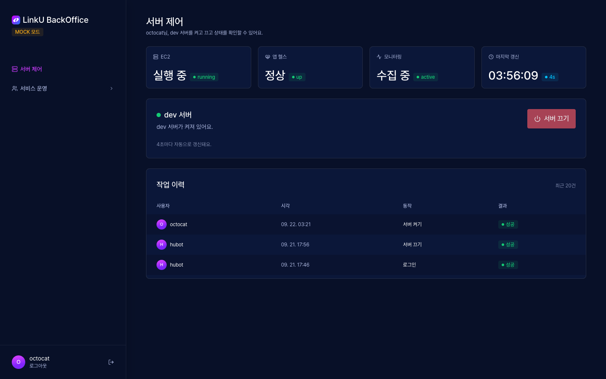
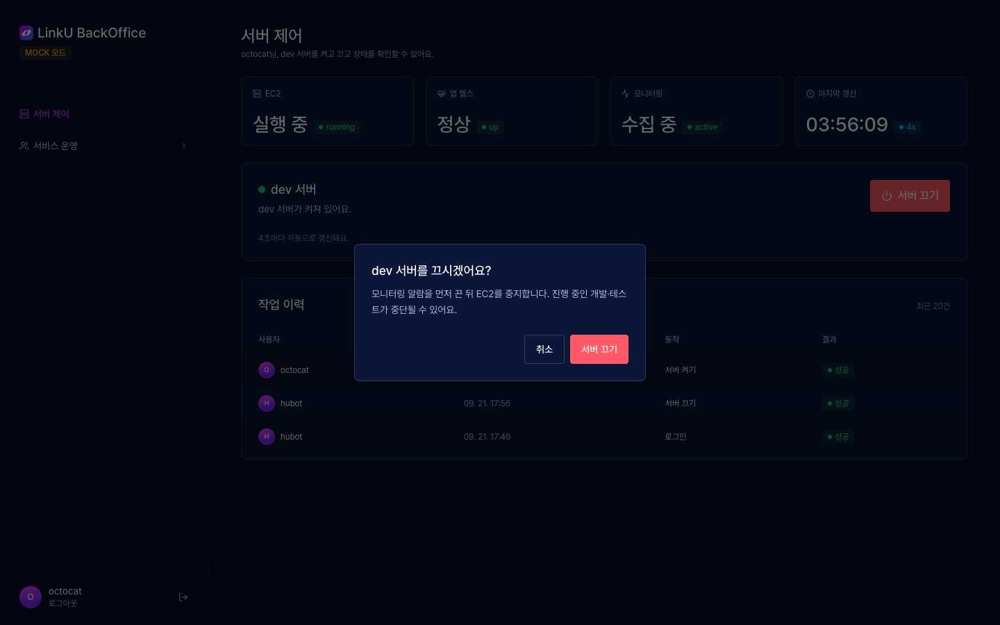
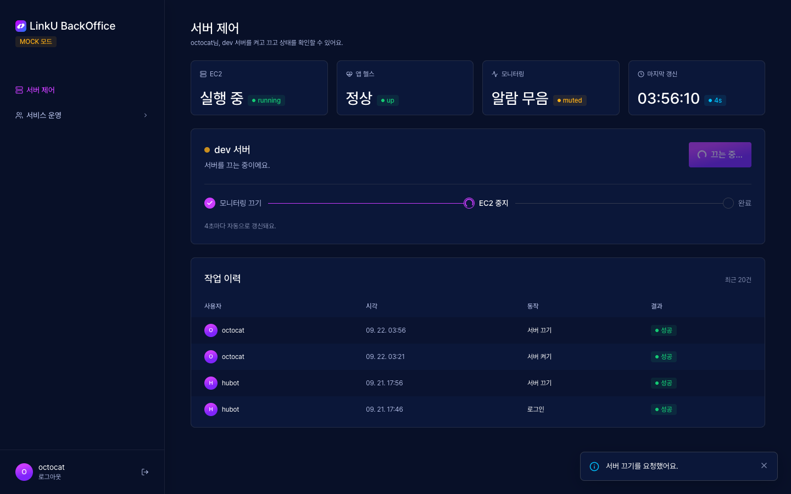
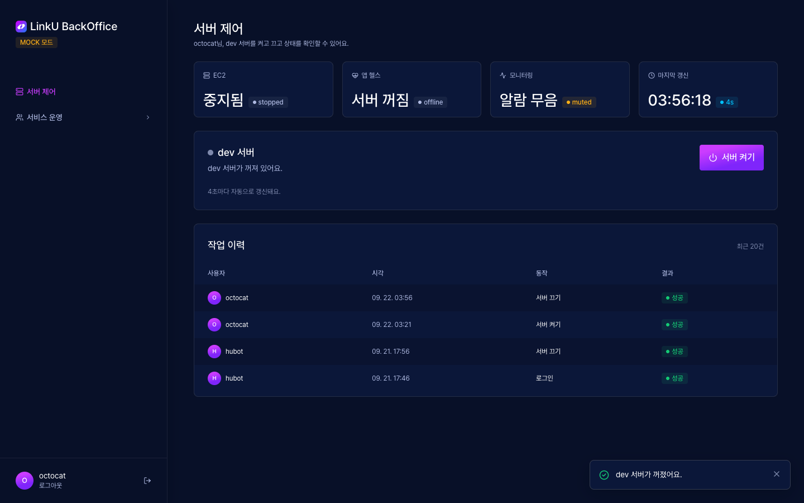
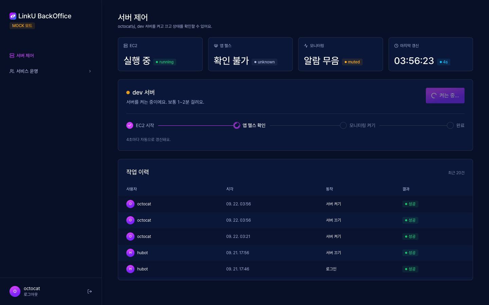
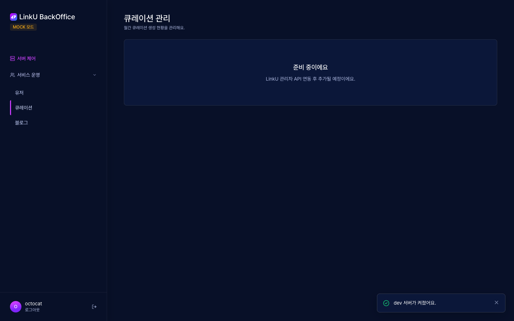

# 🔗 LinkYou BackOffice

LinkYou 프로젝트의 인프라 관리 & 서비스 운영을 위한 BackOffice 레포지토리입니다.

## ✨ 주요 기능

- 🖥️ **서버 제어** — dev 서버(EC2) 켜기/끄기, 상태·작업 이력 확인
- 🛠️ **서비스 운영** — 관리자 API 연동 화면
- 🔐 **GitHub 로그인** — 조직 멤버만 접근

## 📖 사용법

### 1️⃣ 로그인
GitHub 조직 멤버만 로그인할 수 있어요.

### 2️⃣ 서버 상태 확인
EC2 · 앱 헬스 · 모니터링 상태와 작업 이력을 한눈에 볼 수 있어요.

### 3️⃣ 서버 끄기
`서버 끄기`를 누르면 확인창이 떠요.

확인하면 **모니터링 끄기 → EC2 중지 → 완료** 순서로 진행돼요. 알람이 울리지 않도록 모니터링을 먼저 꺼요.

### 4️⃣ 서버 켜기
꺼진 상태에서 `서버 켜기`를 눌러요.

**EC2 시작 → 앱 헬스 확인 → 모니터링 켜기 → 완료** 순서로 진행돼요.

### 5️⃣ 서비스 운영
관리자 API 연동 화면

## 🧰 스택

Vite · React 19 · TypeScript · Tailwind CSS v4 · React Router · TanStack Query · Vitest
